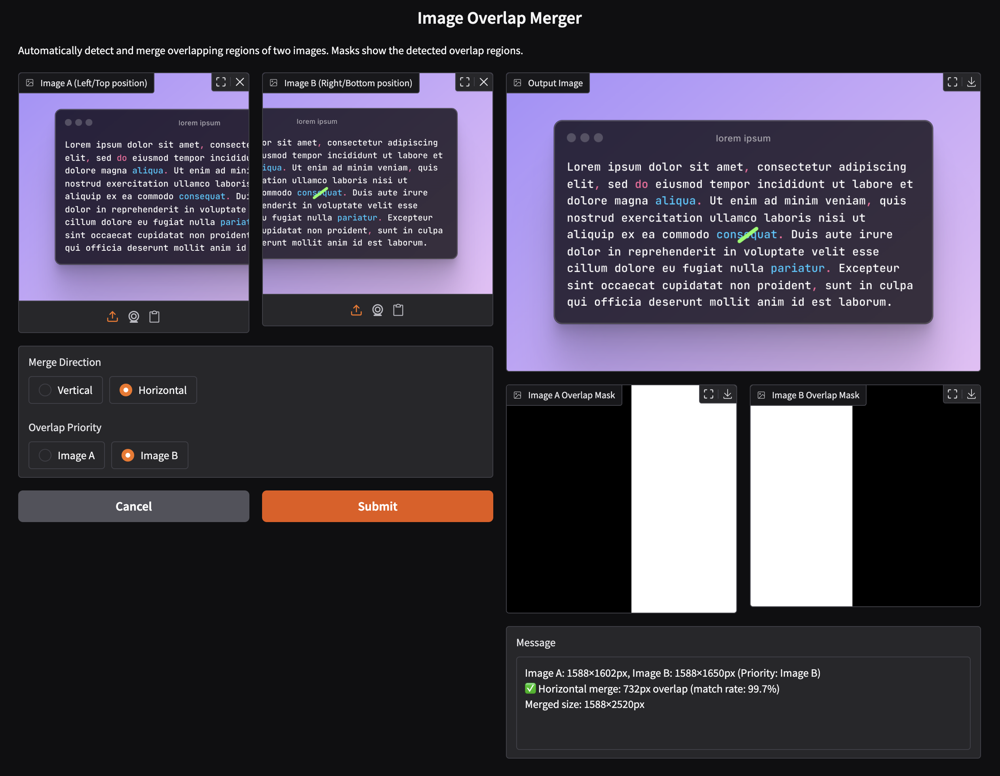

# image-overlap-merger



## Installation
```bash
uv sync
```

## Usage
```bash
uv run app.py
```

## Results

### Vertical Merge

| Input 1 | Input 2 | Output |
|:---------------:|:---------------:|:---------------:|
| |  |  |


### Horizontal Merge

| Input 1 | Input 2 | Output |
|:---------------:|:---------------:|:---------------:|
| |  |  |
